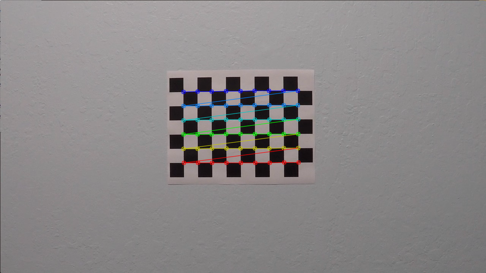
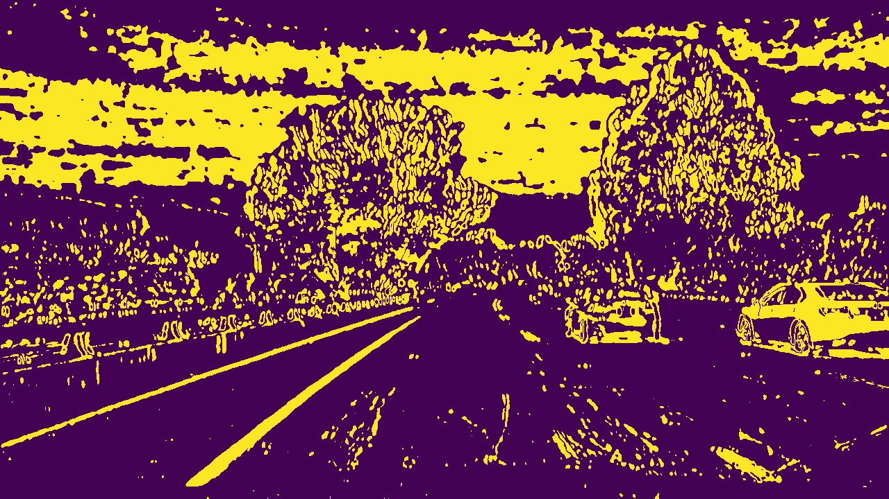
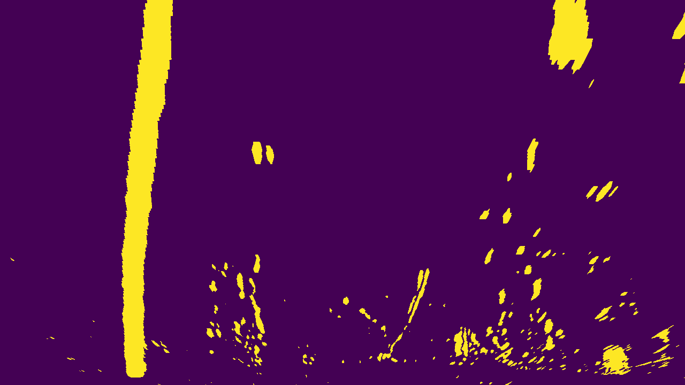
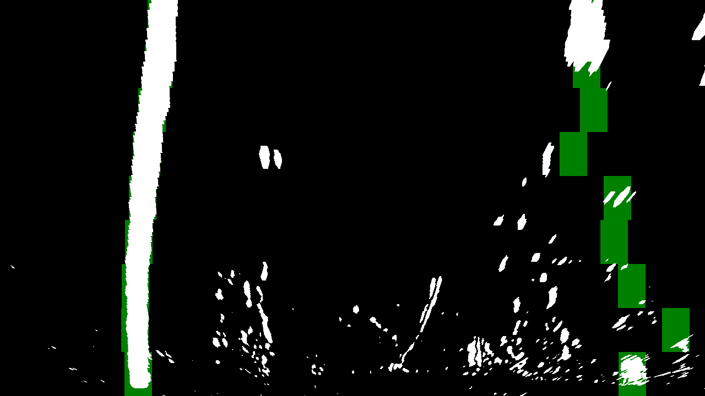
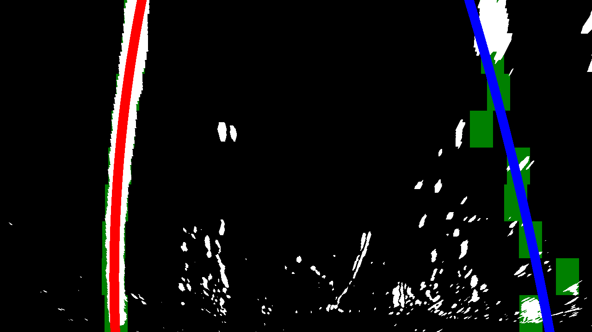
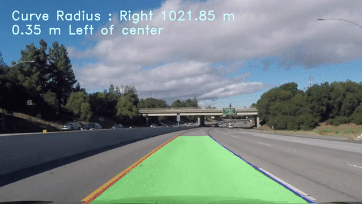
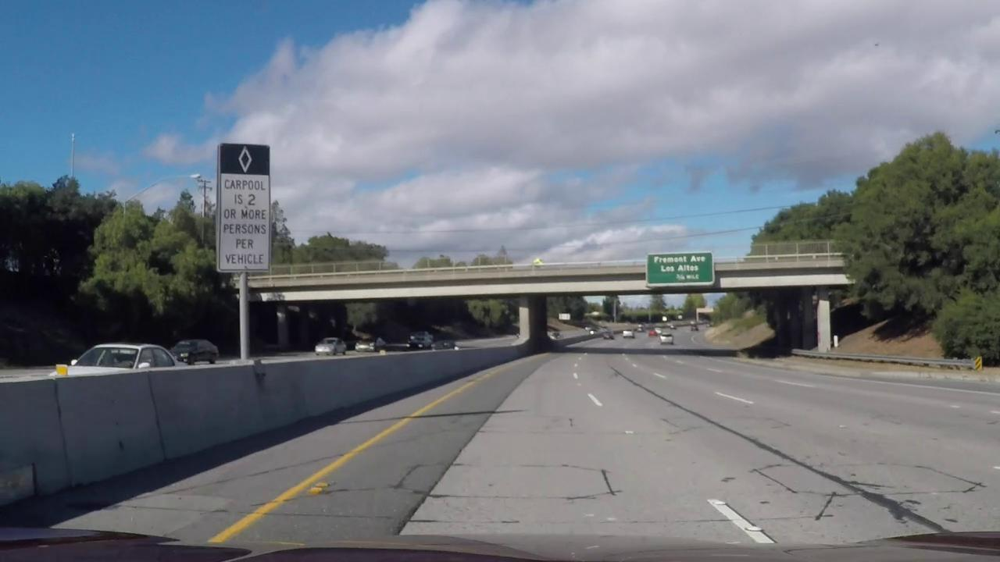
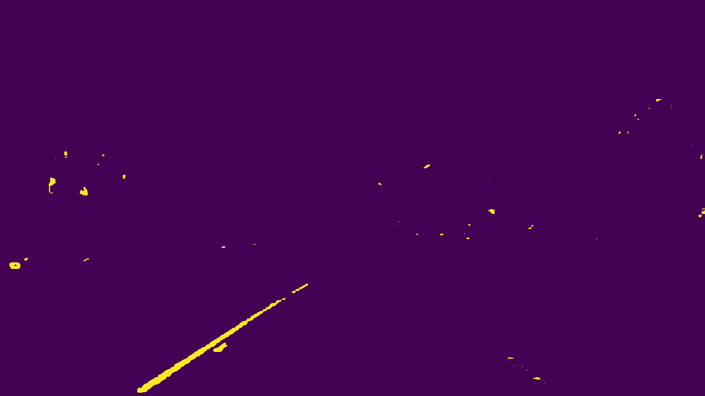

# Advanced Lane Finding
## Udacity Self Driving Car Engineer Nano Degree Project 

The project is to develop a video processing pipline which can take a video stream from a foward-facing camera, annotated video which identifies:
- The positions of the lane lines 
- The location of the vehicle relative to the center of the lane
- The radius of curvature of the road

The pipeline can be briefly described as follows:
- **Step 1**: Apply camera distortion correction using OpenCV and chessboard images.
- **Step 2**: Apply OpenCV functions and HSL color space to transform the color image into a binary one.
- **Step 3**: Apply perspective transformation to transform the forward-facing view to a brid-eye view (warped image).
- **Step 4**: Identify the lane line pixels and fit in a second order polynomial
- **Step 5**: Assuming parameters of the lane would change drastically, use the mean values of polynomials int the previous frames to smoth the result.
- **Step 6**: Calculate the radius of the polynomial in world frame. 
- **Step 7**: Plot the result on the warped image and transform back to a front facing view.
## Some Details:
### Step 1:
#####Code path: `utils/Calibration.py`
Key funtions: 
cv2.findChessboardCorners() - This function would find the positions of all points on the chessboard. Results are in `output_images_calibration/camera_cal`
**A chessbord with image drawn:**

`cv2.calibrateCamera()`- This function would give us the camera matrix and distortion coefficients. 
`cv2.undistort()`- This would take camera matrix and distortion coefficients as input, and undistort a image.
**Original image:**

**Undistorted Image:**

### Step 2:
##### Code path: `utils/Convert2Binary.py`
Key functions:
`cv2.cvtColor(img, cv2.COLOR_RGB2HLS)`- White lines and yellow lines are more clear in S channel and it has the minimal effect of light condition. 
`cv2.Sobel()`- This funtion can calculate the gradiant along x or y axis. Because the lane is always vertical in the image, we would calculate the gradiant along x axis.

Then we would combine this two method to get a better result.
**Binary image**:

### Step 3:
##### Code path:`utils/PerspectiveTrans.py`
Key functions: 
`cv2.warpPerspective()`- This function would allow us change to a bird eye view. The transformed area of original image should be our 'area of interest'
**Bird-eye View**:

### Step 4:
##### Code path:`utils/FindLane.py`
I primaryly used convolution to identify where the lane centers are. The convolution value should be highest when we reach the center of each lane lines. And we would go though each thin layer in y direction to identify where the lane pixels are. 
**Identify the Lane Lines:**

Then, we can try to fit a second order polynomial to each line:
**Fit polynomials:**

### Step 5:
##### Code path: `utils/Memory.py`
I used `deque` to store pervious frame polynomials' coefficients.
### Step 6:
##### Code path: `utils/CalculateRedius.py`
This [Wiki](https://en.wikipedia.org/wiki/Radius_of_curvature) gives a method to calculate the radius of curve. 
### Step7:
##### Code path: `utils/PerspectiveTrans.py` and `utils/DrawText.py`
Key function:`cv2.warpPerspective()`-Again, we would use this function to do a inverse transformation. And plot the result back to the original picture. Also, I annotate the picture by `DrawTest.py`

**Final Result:**

## Future Improvements:
The code cannot work properly on the `challenge_video.mp4`, mainly because there is a diverging line that `Sobel` function would consider as lane:

To cope with this, I propose to use [LAB color space](https://en.wikipedia.org/wiki/CIELAB_color_space), which would seperate yellow color and white color, without the influence of gradients:
**Original Image:**

**Binary Image:**

